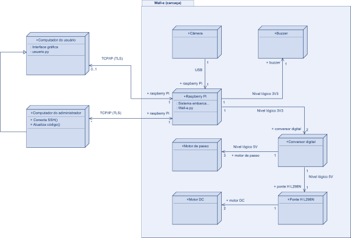
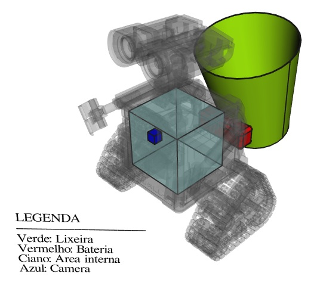

# Desenvolvimento

Podemos dividir o projeto em dois componentes principais: a interface de usuário e o robô Wall-e.

O Wall-e é um robô que pode operar de duas formas: no modo teleoperado e no modo autônomo.

No modo teleoperado, será controlado por um usuário remotamente. O usuário deve possuir uma interface gráfica para controlá-lo. Essa interface deve permitir o controle da direção que para onde o Wall-e se movimenta, da velocidade, do modo de operação (teleoperado ou autônomo) e poder desligar o Wall-e. Além disso, deve receber o vídeo que o Wall-e captura com sua câmera e apresentar ao usuário.

O Wall-e captura o vídeo com uma webcam. Ela estará fixada na frente do Wall-e e conectada à Raspberry Pi por meio de USB.

O usuário pode alterar o Wall-e entre o modo teleguiado e modo automático, além de poder desligar o Wall-e. Apenas um usuário pode controlar o Wall-e simultaneamente.

A comunicação entre o usuário e o Wall-e será feita por meio de pacotes TCP/IP protegidos pelo protocolo TLS, como descrito na página ['Comunicação do usuário com o Wall-e'](comunicacao.md).

A documentação relacionada ao modo teleoperado está na página ['Movimentação do Wall-e no modo teleoperado'](movimentacao.md).

No modo autônomo, o robô deve se movimentar por um ambiente fechado evitando colisões e procurando por lixo que deve ser recolhido. Ao identificar um lixo, deve esperar na frente dele e notificar as pessoas ao redor que esse lixo deve ser recolhido. A notificação será auditiva por meio de um buzzer, e visual por meio do movimento dos braços e cabeça do Wall-e.

A descrição do design do modo autônomo está na página ['Movimentação do Wall-e no modo autônomo'](autonomo.md).

Para que um administrador possa fazer a manutenção de software do Wall-e, será permitido a conexão por meio de SSH e sincronização de código por meio do Rsync. A página documentando esses recursos é a [Administração do Wall-e](administracao.md)

Quando ao hardware utilizado no projeto, será utilizado uma Raspberry Pi, como documentado na página ['Raspberry Pi'](raspberry-pi.md). A alimentação será feita por meio de uma bateria de Lítio polímero descrita na página ['Bateria'](bateria.md).

Antes de modelar o porjeot, é necessário conhecer os motores utilizados. Para isso, é necessário validação em laboratório deles. A documentação referente a isso está disponíel na página ['Validação dos motores'](validacao-motores.md).

Os casos de uso do projeto podem ser observados no diagrama abaixo.

## Sumário

É recomendado a leitura das seguintes páginas antes de prosseguir para o circuito completo do projeto

1) [Comunicação do usuário com o Wall-e](comunicacao.md)
2) [Movimentação do Wall-e no modo teleoperado](movimentacao.md)
3) [Movimentação do Wall-e no modo autônomo](autonomo.md)
4) [Administração do Wall-e](manutencao.md)
5) [Raspberry Pi](raspberry-pi.md)
6) [Bateria](bateria.md)
7) [Validação dos motores](validacao-motores.md)

## Circuito completo do projeto

A implementação do projeto pode ser representada pelo seguinte diagrama de implementação.

A maquete eletrônica do projeto esta apresentada a seguir.

Fonte: Autoria Própria - Feito no software Fritzing

O esquemático da placa que deve ser confeccionada para o projeto é o seguinte:

## Posicionamento dos componentes

Não há espaço para a bateria dentro do Wall-e, então ela será posta nas costas dele, embaixo da lixeira. Além disso, tem a questão térmica: dentro do Wall-e há componentes que podem dissipar bastante potência. Não é adequado deixar uma bateria nessas condições. Será feito um suporte em 3D para a bateria fora do Wall-e.

A lixeira deve ser compacta, considerando o tamanho do Wall-e. Aproximadamente 20 cm de altura é um tamanho que não atrapalha as funções do robô.

Segue o modelo de como os componentes devem ser organizados no Wall-e.

Fonte do modelo do Wall-e: [Arquivos de impressão](https://drive.google.com/drive/folders/1OQ6YMb921c41Y6ldHbr-t6RvSBLLQeH1)

Será confeccionada uma placa para facilitar a organização dos componentes dentro do Wall-e. Ela será fixada na parte interior do robô. A disposição dos componentes dentro dele depende do tamanho dessa placa e deve ser definida assim que ela for confeccionada. Por isso, ainda não foi representada no modelo 3D anterior. A região interna do Wall-e disponível para isso é de, aproximadamente, um cubo de 11 cm de aresta.

#### Dimensões dos componentes

Para elaborar o suporte da bateria e organizar a disposição dos componentes dentro do Wall-e, é necessário conhecer suas dimensões:

- Ponte H L298N: base de 43,4 mm x 43,0 mm; altura de 39,2 mm.
- Conversor step-down: base de 26,0 mm x 53,0 mm; altura de 14,0 mm.
- Módulo Buzzer: base de 13,2 mm x 38,3 mm; altura de 10,6 mm.
- Conversor digital: base de 12,5 mm x 15,5 mm; altura de 11,2 mm.
- Conversor digital sem suporte: base de 12,8 mm x 15,5 mm; altura de 2,6 mm.
- Bateria: base de 38 mm x 105,5 mm; altura de 34 mm.

Componentes que fazem parte da placa confeccionada, como os reguladores de tensão LM7805 e LM317, não estão incluídos nessa lista.

A região interna do Wall-e disponível para organizar os componentes possui dimensões de:

- Base: 11,80 cm x 13,30 cm.
- Altura: 13,20 cm.

### Lista de componentes

| Componente | Quantidade |
| :---: | :---: |
| Carcaça do Wall-e impressa | 1 |
| Motores DC | 2 |
| Moteres de passo SG90 | 3 |
| Bateria Turnigy Nano-tech Lipo 3s | 1 |
| BMS 4s | 1 |
| Raspberry Pi 1 | 1 |
| Conversor step-down | 1 |
| Conversor de nível lógico (4 níveis) | 2 |
| Módulo Buzzer ativo MH-FMD | 1 |
| Driver Ponte H L298N | 1 |
| Fusível térmico | 1 |
| Fusível de 2A | 1 |
| Suporte para fusível | 1 |
| Interruptor | 1 |
| LM317 | 2 |
| LM7805 | 1 |
| Resistores de 2 Omhs, 1.5W | 2 |
| Capacitor 0.33uF | 1 |
| Capacitor 0.1uF | 1 |
| Webcam | 1 |

---
Topo: [equipe_LuLu](../README.md) | Próximo: [Comunicação do usuário com o Wall-e](comunicacao.md)
