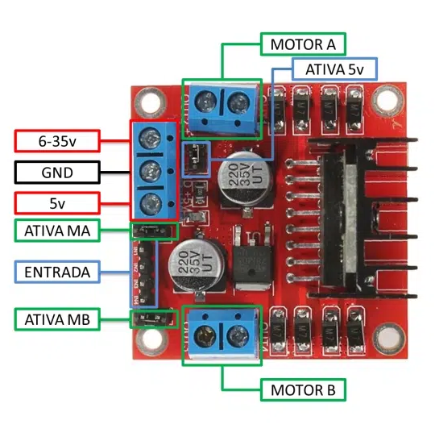
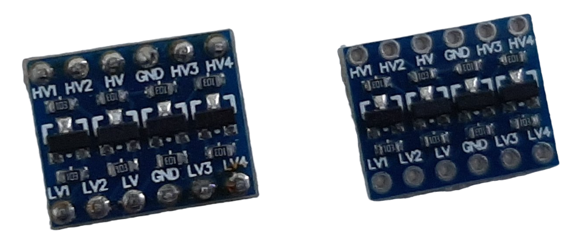

# Movimentação do Wall-e no modo teleoperado

No modo teleoperado, a movimentação do Wall-e será definida exclusivamente pelo operador (pessoa que controla o Wall-e). Ou seja, não há nenhum código controlando a movimentação do Wall-e de forma automática.

## Motores

O controle da velocidade dos motores será feito por meio de um PWM em software usando as GPIO da Raspberry Pi.

O duty cycle do PWM definirá a velocidade com que o Wall-e se movimentará e a forma como ele realizará as curvas. O eixo das rodas do Wall-e são fixos e não podem ser direcionados. Ou seja, não é possível que o Wall-e faça uma curva rotacionando suas rodas. Para girar o Wall-e, será necessário alterar a velocidade com que os motores das rodas giram. Girar a roda da esquerda mais rápido fará o Wall-e virar para a direita e vice-versa.

Já os motores de passo usados para mover os braços e cabeça do Wall-e, são controlados por meio da largura de pulso do PWM aplicado no terminal de controle. Também serão controlados usando os PWM em software da Raspberry Pi. Serão controlados apenas 3 dos 6 motores de passo. Os motores do braço e do pescoço. O movimento dessas partes serão usados para notificar a identificação de lixo, como proposto na página [Movimentação do Wall-e no modo autônomo](autonomo.md).

Dependendo da exigência de processamento e comunicação da Raspberry Pi, ela pode não conseguir controlar o PWM do motor adequadamente. Assim, pode ser necessário terceirizar esse trabalho para um microcontrolador. Nessa situação, será usado uma esp32 para controlar os motores DC e de passo, enquanto a Raspberry Pi será responsável apenas pelo streaming de vídeo e enviar os comando para o esp32 por meio do wifi.

### Limitadores de corrente

Existe a possibilidade dos motores (tanto DC quanto de passo) travarem durante sua operação. Nessas condições, o consumo de corrente deles aumenta bastante. Para proteger a bateria nessas situações, deve-se limitar a correntes dos motores.

Será usado um circuito para limitar a corrente dos motores DC, e um para os motores de passo. É importante limitar eles de forma individual. Assim, se um dos motores travar e o limitador atuar, apenas o limitador associado a esse motor será acionado. Isso quer dizer que, se o motor de passo travar, o limitador do motor DC não será acionado e ele continua a operar normalmente.

Para limitar a corrente, será usado um circuito limitador de corrente com o LM317. É um circuito bastante conhecido e disponível, inclusive, nos datasheets desse componente. Veja a imagem abaixo:

Fonte: datasheet LM317, Texas Instruments

A corrente de consumo dos motores é parâmetro medido e validado em laboratório. Os dados relacionados estão disponíveis na página ['Validação dos motores'](validacao-motores.md).

A corrente DC dos motores está na faixa de 170mA sem carga. Com carga está em 580mA. Como o Wall-e é leve e a lixeira acoplada será pequena, não será carregado muito peso. Assim, será considerado, inicialmente, uma corrente média de 300mA para cada motor. Esse valor será ajustado futuramente se o Wall-e necessitar de mais corrente. Por enquanto, será usado apenas para dimensionar o limitar de corrente.

Inicialmente, a corrente do motor DC será limitada em 300mA por cada motor. No total, 600mA. A resistência necessária para limitar a corrente será de:

$$I={{1,2V} \over R} \Rightarrow R={{1,2V} \over I} = {{1,2V} \over 600mA} = 2 \Omega$$

A potência mínima do resistor será de:

$$P = V \cdot I = 1.2V \cdot 600mA = 0,72W$$

Por segurança, será usado um resistor de no mínimo 1,5W.

Quanto a limitação de corrente dos motores de passo, eles consomem pouca corrente quando estão parados (na faixa dos 10mA). Ao mover, o consumo de corrente aumenta bastante, podendo chegar a mais de 1A caso um desses motores trave. Inicialmente, serão limitados em 600mA no total (todos os motores juntos). Dessa forma, pode-se usar um resistor igual ao do motor DC para os de passo. Futuramente, talvez esse valor deva ser ajustado.

### Driver ponte H

Para movimentar o Wall-e, será necessário, além de controlar a largura de pulso do PWM, controlar o sentido dos motores DC. Será usado um drive ponte H L298N. Ele permite inverter o sentido de rotação do motor invertendo o sentido da corrente que passa por ele.

A conexão padrão desse componente está ilustrada abaixo:

Fonte: [Makehero - Motor DC com Driver Ponte H L298N](https://www.makerhero.com/blog/motor-dc-arduino-ponte-h-l298n/)

- 6-35V: alimentação da ponte H.
- GND: Tensão de referência da ponte H.
- 5V: Saída de 5V disponibilizada pela ponte H (possui regulador interno). Caso a alimentação de 6-35V não seja usada e o jumper ATIVA 5V esteja ativo, o conector de 5V fornece uma alimentação de 5V com limitação de até 200mA. No caso de o jumper ATIVA 5V estiver desconectado, a porta 5V atua como uma alimentação de 5V para os motores.
- ATIVA MA e ATIVA MB: Jumpers que habilitam os motores DC. Remover os jumpers desabilita eles.

Nesse projeto, os motores necessitarão de mais de 5V de alimentação, que estará ligada ao conector de 6-35V; portanto, o jumper ATIVA 5V estará ativo (não será usada alimentação de 5V para os motores).

Os dois motores serão usados; então, os jumpers ATIVA MA e ATIVA MB estarão ativos.

O controle do sentido de rotação é dado pelas entradas de 4 pinos do driver (marcada de azul na imagem anterior). O sentido dos motores depende dos níveis lógicos dessas entradas conforme a seguinte tabela da verdade:

| Comportamento do motor A | IN1   | IN2   |
| :---:                    | :---: | :---: |
| Horário                  | 5V    | GND   |
| Anti-horário             | GND   | 5V    |
| Ponto morto              | GND   | GND   |
| Freio                    | 5V    | 5V    |

Fonte: [Makehero - Motor DC com Driver Ponte H L298N](https://www.makerhero.com/blog/motor-dc-arduino-ponte-h-l298n/)

A tabela do motor B é análoga a do motor A.

O acionamento desses pinos será feito pelos GPIO da Raspberry Pi.

Há uma proteção interna de chaveamento que impede o curto-circuito da ponte H em caso de acionamento de IN1 e IN2 ao mesmo tempo.

Os limitadores de corrente dos motores DC serão postos na alimentação do driver ponte H.

### Conversores de nível lógico

Como as saídas da Raspberry Pi são de 3.3V, é necessário usar um conversor de nível lógico para acionar circuitos digitais de 5V. O driver ponte H, assim como os motores de passo são acionados em 5V.

São necessárias 4 conexões digitais para a ponte H e 3 para o motor de passo. Assim, são necessárias 7 conexões no total. Cada conversor pode converter até 4 sinais digitais. Portanto, são necessários 2 conversores no total.

### Código para controlar os motores

O código será escrito em Python usando o módulo RPi.GPIO. Os PWM desse módulo são todos implementados em software (ainda não possuem suporte a PWM em hardware).

Em caso de o desempenho dessa implementação não for decente o bastante, os motores serão controlados usando um esp32 e a Raspberry Pi será responsável apenas pelo Streaming de vídeo. Isso alivia o trabalho sobre a Raspberry Pi.

Para o controle dos motores de passo, seu ângulo será variado lentamente. Evitar mudanças bruscas no ângulo do motor evita um consumo muito grande de correte por partes dele. Como informado anteriormente, esses motores podem possuir altas correntes se aplicado uma carga.

---
Anterior: [Comunicação do usuário com o Wall-e](comunicacao.md) | Topo: [Desenvolvimento](README.md) | Próximo: [Movimentação do Wall-e no modo autônomo](autonomo.md)
