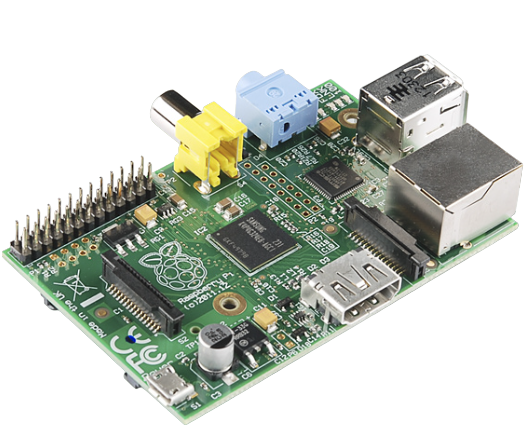

# Raspberry PI 

Raspberry Pi é um computador desenvolvido no Reino Unido pela Fundação Raspberry Pi. É basicamente um computador, semelhante a um PC, extremamente portátil, embora menos potente. Todo o hardware é integrado em uma única placa de tamanho reduzido, e por conta disto se torna muito versátil.

 

Fonte: [Raspberry Pi - Model B](https://www.sparkfun.com/products/retired/11546)

Em 2006, professores e pesquisadores da Universidade de Cambridge apaixonados pela computação e programação se reuniram para criar um computador mais acessível, uma história bem parecida com a do Arduino, porém só no ano de 2012 a ideia veio a se tornar realidade.

Inicialmente, o objetivo principal era de estimular o ensino de ciência da computação básica em escolas; contudo, seu uso foi ampliado e estão sendo utilizados em automação, internet das coisas (IoT), entre outros.

Fonte: [Diolinux - O que é o Raspberry Pi](https://diolinux.com.br/tutoriais/o-que-e-o-raspberry-pi.html)

## Modelo do Controlador Principal Usado ( RASPBERRY PI 1 )

Após entender a história e para qual finalidade serve uma Raspberry Pi, vamos detalhar qual a mesma que será utilizada no projeto lixeira automática com o Wall-e.

### Nome 

A raspberry usada neste projeto é a "Raspberry PI 1", uma das primeiras feitas e lançada em 15/02/2012

### Processador

O sistema de processamento da raspberry é baseado em um sistema-em-um-chip (SoC) ou microcontrolador Broadcom BCM2835 e conta com processadores tipo ARM que usa a arquitetura RISC (Reduced Instruction Set Computer), tipo de arquitetura de processadores que usa um conjunto de instruções simples, e são projetadas para executar mais instruções em menos tempo.
O processador usado é o Broadcom BCM2835 e a CPU ARM1176JZF-S de 700 MHz.

### Especificações Gerais

A raspberry PI 1 conta com as seguintes entradas: 

- Broadcom VideoCore IV @ 250 MHz
- 2 Porta USB: Consiste em 2 entradas USB para conectar teclado, mouse ou qualquer outro periférico
- Micro USB
- CSI para Câmera
- Saída de Vídeo HDMI e RCA
- Interface de Rede Ethernet
- Saída de áudio P2
- GPIO (Entrada/saída de uso geral)

### Consumo e Potência

O consumo de potência da Raspberry é de 1 Watt, e como a alimetação da mesma é de 5 V, a corrente máxima é então de 200 mA.
Fonte: [everpi - Consumo do raspberry Pi](http://blog.everpi.net/2015/04/projeto-consumo-do-raspberry-pi-parte-3-modelo-b-plus.html)

### Portas GPIO 

As portas GPIO ou Entrada/saída de uso geral, são portas programáveis de entrada e saída de dados, e servem para prover uma comunicação/interface entre o programador e os microcontroladores/microprocessadores que a Raspberry Pi é constituida.

O Raspberry Pi oferece a capacidade de se conectar diretamente a diversos dispositivos eletrônicos com as portas USB, video etc.  Contudo por meio de suas interfaces GPIO é importante notar que as conexões não são "plug and play" e exigem extremo cuidado para evitar conexões incorretas, que podem danificar o equipamento. 

Outrossim, os GPIOs do Raspberry Pi operam com níveis lógicos de 3,3 V, e é necessário ter cuidado ao conectá-los a dispositivos que operam com níveis de 5 V, podendo danificar o Raspberry Pi, a menos que sejam usados circuitos de conversão de nível, no wall-e para a utilzação do GPIO será utilizado um destes conversores lógicos. 

A interface GPIO oferece conexões que permitem:

- Saídas digitais: Permitem controlar dispositivos, como luzes ou motores, ligando ou desligando-os.

- Entradas digitais: Permitem ler o estado de dispositivos, como botões ou sensores, indicando se estão ligados ou desligados.

- Comunicação com chips ou módulos usando protocolos de baixo nível, como SPI, I2C ou serial UART.

Vale ressaltar que o Raspberry Pi não oferece saídas ou entradas analógicas diretamente, mas é possível adicionar essa funcionalidade por meio de placas complementares, como a Rpi Gertboard.

Fonte: [GPIO - Pinout](https://elinux.org/Category:RaspberryPi)

### PWM (Modulação por Largura de Pulso)

A Modulação por largura de Pulso, é uma maneira de se manipular uma forma de onda quadrada mantendo a frequência constante e se variando intervalo de tempo em que se permanece em nível lógico alto durante o período de frequência, consequentemente conseguimos alterar a potência entregue para carga em questão.

Com o PWM podemos fazer diversas aplicações como: Controle de velocidade rotação ou torque em motores DC ou servos motores, controle de luminosidade e etc.

No caso do PWM, na Raspberry Pi 1, temos apenas 1 pino GPIO que é designado a PWM (GPIO 18) ou então utiliziando bibliotecas podemos fazer o chamado PWM por software que é uma técnica usada para gerar sinais analógicos de um dispositivo digital e portanto obter mais pinos PWM.

    
Fonte: [ Eletrônica para Artistas - Esquemático PWM ](https://eletronicaparaartistas.com.br/circuitos-integrados-7-pwm-com-555/)

### Dimensões

As dimesões da Raspberry Pi 1 é de 85,60 mm × 53,98 mm.

## Sistema operacional

O sistema embarcado na Raspberry Pi será o Raspberry Pi OS legacy. É um sistema fornecido pela própria organização da Raspberry Pi e está disponível no seguinte endereço eletrônico: ['Raspberry Pi - Operating system images'](https://www.raspberrypi.com/software/operating-systems/).

O sistema é baseado no Debian 10 (Buster) e feito para arquiteturas ARM 32bits, que é o caso do Raspberry Pi 1.

Existem outras versões de sistemas operacionais disponíveis para os modelos de raspberry Pi, mas a versão que usaremos suporta apenas o legacy.

---
Anterior: [Administração do Wall-e](manutencao.md) | Topo: [Desenvolvimento](README.md) | próximo: [Bateria](bateria.md)
