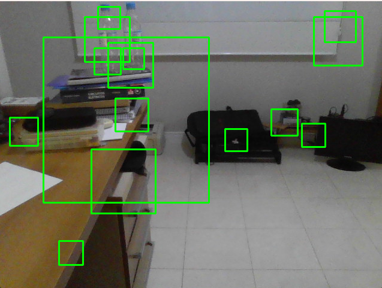
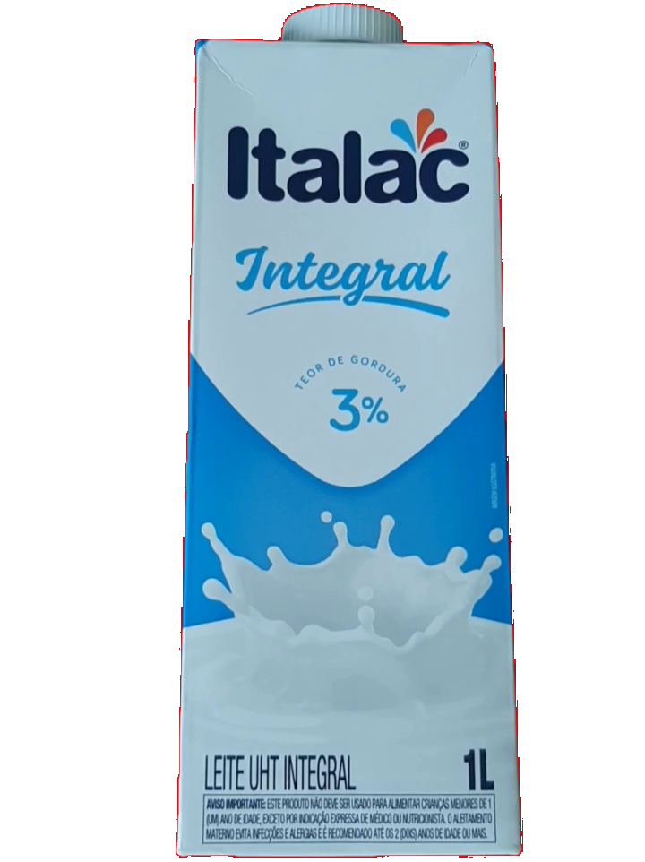

# Treinamento do Modelo de Idenficação Utilizando Haar Cascade

Criado por Viola e Joaes o Haar cascade é o algoritmo de detecção de objetos mais popular do OpenCV. Ele é muito usado por sua rapidez. Um dos seus pontos baixos é alguns problemas com detecções falsas de objetos, quando comparados a alguns algoritmos mais atuais.

O algoritmo é capaz de detectar objetos em imagens, independentemente de sua localização e escala, além disso este algoritmo pode ser executado analisando um streaming de vídeo.

Inicialmente o Haar cascade foi feito com a finalidade de detecção de rostos, contudo ao longo do tempo houveram diversas contribuições da comunidade interessada entre outros, que fizeram a estrutura pode ser usada para treinar detectores para “objetos” arbitrários, como: rostos, carros, pessoas, animais, lixo (na qual o projeto tem finalidade), entre outros.

O algoritmo consegue detectar diversos objetos, é disponibilizado na rede alguns modelos já pré-treinados e assim não necessita um treinamento, no caso do wall-e não foi encontrado nenhum estudo ou conteudo feito com o haar cascade para identificação de lixo, portanto o algoritmo que vai ser implementado precisa de treinamento e assim ao longo do tempo vai se ampliando a varidade de lixo e a quantidade de acertos.

O Haar cascade seleciona um pequeno número de características visuais críticas de uma determinada imagem e as utiliza para detecção e classificação do objetos. O modelo usa o chamado "Haar-like feature", e obtem características para cada uma dessas cinco áreas retangulares, e assim simplesmente subtraímos a soma dos pixels sob a região branca da soma dos pixels sob a região preta.

Fonte: [Haar Cascade](https://www.cs.cmu.edu/~efros/courses/LBMV07/Papers/viola-cvpr-01.pdf)

O algoritmo necessita de muitas imagens positivas e imagens negativas para treina-lo. Então precisamos extrair recursos dele. Para isso, são utilizados recursos Haar mostrados na imagem abaixo. Eles são como o "convolutional kernel".

Fonte: [ Função Haar ](https://en.wikipedia.org/wiki/Haar-like_feature)

Dai surge o nome Haar cascade, onde tem-se uma entrada de imagem e então consegue-se com o classificador retirar características "Haar" dentro de uma série de classificações (cascade), para identificar um imagem.

## Haar Cascade para Idenficação de imagem

A partir de tal explicação, a proxima etapa é:
- Fazer a implementação do Haar cascades com o openCV para identificar varios tipos de lixo.
- Treinamento do modelo de Idenficação.
- Obter um sistema de indentificação de imagem recebidos pela câmera localizada no Walle, que possa entender e determinar se tal objeto encontrado na tela, é ou não um lixo.

Para a implementação e treinamento do haar cascade, foram feitos os seguintes processos: 

1) Escolher o objeto desejado a ser identificado.
2) Obter imagens do objeto a ser identificado chamado 'LIXO' e imagens de outros objetos não desejados denominados 'NÃO LIXO'.
3) Transformar as imagens lixo e não lixo em: Preto e branco, trocar o tamanho das mesmas para 100x100, e após criar 2 pastas denominadas: 'POSITIVAS' contendo as imagens determinadas como lixo e 'NEGATIVAS' contendo as imagens não lixo, estes são parâmetros padrões do haar cascade.
4) Criar um arquivo, este arquivo vai diferenciar as imagens de treinamento, sendo: Imagens positivas estão no conteúdo criado Info.txt e as demais imagens negativas é criado um documento chamado bg.txt ( background ).

Fonte: [Treinamento Haar Cascade - OpenCV](https://docs.opencv.org/3.4/dc/d88/tutorial_traincascade.html )

Após todos os passos anteriores feitos, parte-se para o treinamento do modelo que consiste nos seguintes passos, utilizando as funções do próprio haar cascade:

1) Createsamples, criando imagens, onde pega-se um modelo ( imagem determinada lixo ), e é sobreposta em cima de todas as imagens negativas e da mesma forma é rotacionada a imagem modelo para que obtenha-se mais imagens para treinamento.
2) Createsamples, agora é criado um vetor positivo ( positives.vec ) contendo todas as imagens criadas antes.
3) Traincascade, agora usando a função de treinamento, o sistema ficará rodando por horas identificando nas imagens misturadas ( com uma positiva e cima de uma negativa ), e assim determinando aonde está as imagens positivas e quando achar e identificar, o sistema terá uma resposta e assim um treinamento.

Fonte: Autoria Própria

Obs: O haar cascade deve ter diversas fotos para o treinamento, na faixa de 10 mil fotos um treinamento pode ser considerado ainda problemático e que apresenta diversos erros.

Após o treinamento um arquivo cascade.xml, junto dele todos os estágios de treinamento e por fim este será o arquivo de treinamento contendo tudo necessário para a identitificação de objetos.

Observações importantes:

- Se as imagens são poucas, haverá diversos problemas de identificação de outros objetos parecidos.
- Sombras e claridades fazem com que o identificador fique dando algumas falsas identificações, para solucionar o problema pode-se tentar aumentar o número de estágios de treinamento.
- Treinar o modelo demais ( aumentar demais o número de estágios ), resulta em problemas, pois o modelo de treinamento vai espeficamente identificar só aquele tipo de imagem/lixo na tela.

## Falsas Detecções
Ao longo do processo de treinamento foi obtido diversos arquivos de com vários problemas de falsas cognátas, portanto a única coisa a fazer foi alterar parâmetros e se não melhorar treinar o modelo novamente, a figura a seguir mostra um treinamento problemático:

Fonte: Autoria Própria

## Resultados Final (Garrafa de Água)

Ao final de treinamento mais qualificado, já com o arquivo cascade.xml em mãos, agora parte-se para os testes para determinar uma melhor configuração para determinada aplicação, portanto dependerá do que for necessário pode ser encontrado no site oficial do haar cascade, configurações de visualizações melhores ou piores para o tipo de treinamento feito.

O resultado final para teste obtido foi satisfatório para um primeiro momento, tendo em vista que, futuramente será melhorado e treinado com mais detalhes o modelo, diminuindo ainda mais as falsas detecções.

É possivel observar na imagem abaixo o modelo treinado identificando as 2 garrafas pets presentes no streaming de vídeo, e ignorando outros objetos ao redor da imagem. Agora é implementar o treinamento no wall-E.

Fonte: Autoria Própria

Após diversos testes para encontrar a melhor configuração, era muito receoso para os alunos ter que baixar a resolução, porém era necessário para o processamento de imagem da raspberry e portanto ao baixar a resolução era obtido problemas maiores de falsas cognatas. Após o melhor treinamento de modelo feito, baixamos a resolução e foi obtido um resultado surpreendente, sendo o mesmo melhor quer outros já feitos.

Portanto, baixar a resolução no caso deste projeto, foi uma das soluções para melhorar problemas de identificação e erros. Foi feito um video, mostrando o modelo identificando o lixo com a resolução baixa.

**Video - Resultado (Garrafa de Água)**

[Video - Modelo de Identificação usando Haar-Cascade](https://youtu.be/ExhZpDbkwm0)

Fonte: Autoria Própria

## Correção dos Resultados Final (Garrafa de Leite)

Após implementar o modelo de indeificação no wall-e foram obtidos resultados péssimmos, nos quais foi decidido mudar o objeto de identificação como lixo, por conta de reflexo e uma gama de erros que era obtido com o modelo treinado antigo.

Por conta de tais fatores, foi utilizado outro objeto no caso uma garrafa de leite, igual a imagem a seguir.

Fonte: Autoria Própria

Agora, não havendo problemas com transparencia e nem reflexo, pode ser feito um treinamento maior, mais qualificado e que foi possivel obter um resultado incrível.

Após horas de validação de imagem e 14 horas de treinamento, foi possível implementar o novo modelo de identificação de objeto no wall-e e após isto o wall-e estava identificando o lixo escolhido e treinado.

