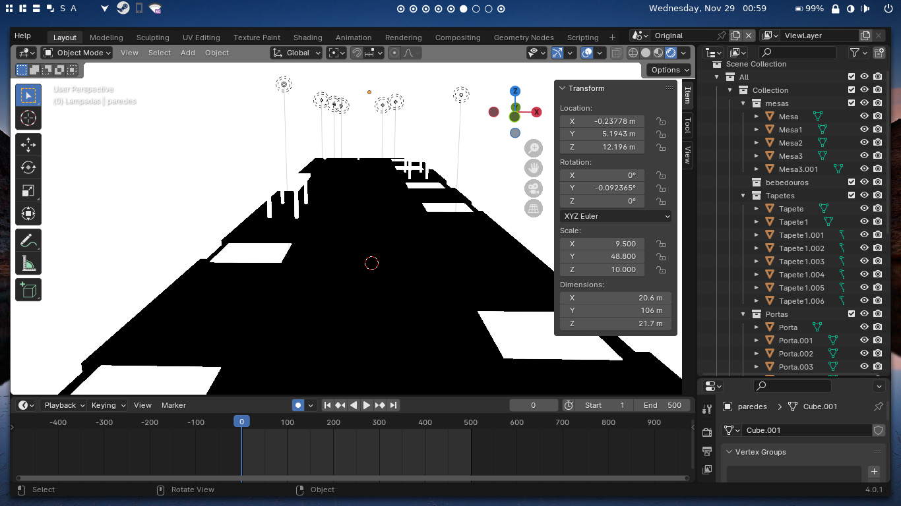
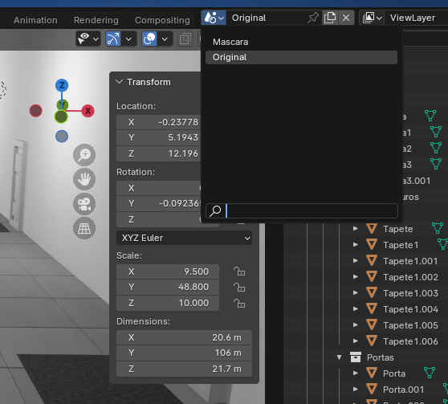

# Código da computação gráfica

Implementação da geração de imagens e suas máscaras por meio de computação gráfica. Há dois modelos do Blender disponíveis para gerar as imagens e máscaras:

- [salas.blend](salas.blend): arquivo com uma sala e alguns objetos.
- [salas_sem_obstaculos.blend](salas_sem_obstaculos.blend): arquivo com uma sala, mas com menos objetos. Gera imagens mais simples e mais fáceis de treinar.

É possível alterar a cor, textura, caminho da câmera, formato e posições dos objetos desses modelos para gerar as imagens.

Há um script para auxiliar na geração das imagens: [define_material.py](define_material.py). Ele foi feito para ser usado apenas dentro da interface de Scripting do Blender. Não execute fora dela. Sua função é mudar os materiais dos objetos para mostrar a imagem original, ou a máscara de colisão. Ajustando o parâmetro *MATERIAL_INDICE* para 1 e executando, as máscaras são aplicadas a todos os objetos.

Ajustando para 2 e executando, volta para o original.

A documentação dos scripts dessa pasta estão disponíveis em [documentação dos scripts de CG](../../../../docs/_build/markdown/_autosummary/codigo.segmentacao.datasets.CG.md).

## Exportar imagens

Primeiramente será explicado como exportar as imagens originais.

Para exportar as imagens, primeiramente mude a cena atual para 'Original', como no exemplo abaixo:

Após isso, execute o script [define_material.py](define_material.py) com o parâmetro *MATERIAL_INDICE* igual a 2. Agora basta renderizar a animação. As imagens serão salvas no diretório "blender-output/original/". O Blender criar esse diretório por conta própria.

Para renderizar as máscaras, o processo é análogo. Primeiramente, mude a cena para 'Mascara'. Depois, execute o script [define_material.py](define_material.py) com o parâmetro *MATERIAL_INDICE* igual a 1. As imagens estão salvas no diretório "blender-output/mascara/".

Agora basta copiar o diretório "blender-output" para dentro do diretório "../imagens-dataset" e prosseguir com a [criação do dataset](../)

**Importante:** Antes de criar um conjunto de imagens e máscaras, recomenda-se excluir o antigo diretório "blender-output/" para evitar que as antigas imagens geradas continuem nele. Isso deve ser feito manualmente, não há script ou função do Blender que automatize isso.
