# **DESIGN**

## Resumo

Nesta etapa será apresentado as soluções utilizadas para realizar o projeto. Consistirá em diagramas de alto nível de software, hardware e esquemáticos elétricos. 

O projeto terá ao todo 4 componentes principais que são:
+ Sistema de telemetria embarcada;
+ Receptor da telemetria;
+ Controle remoto;
+ Atuadores remotamente controlados.

## Sistema de telemetria veicular

Internamente ao protótipo veicular será instalado o sistema de telemetria embarcada que terá o papel básico de obter dados dos sensores instalados pelo veículo, armazenar em um cartão de memória e transmitir sem fio para o receptor fora do veículo. O seguinte diagrama de alto nível ilustra o funcionamento do receptor e transmissor dos dados em tempo real:

## Sistema de telemetria embarcada

### Componentes principais da telemetria embarcada

O seguinte diagrama apresenta os componentes em alto nível que serão usados para a obtenção, transmissão e armazenamento dos dados:

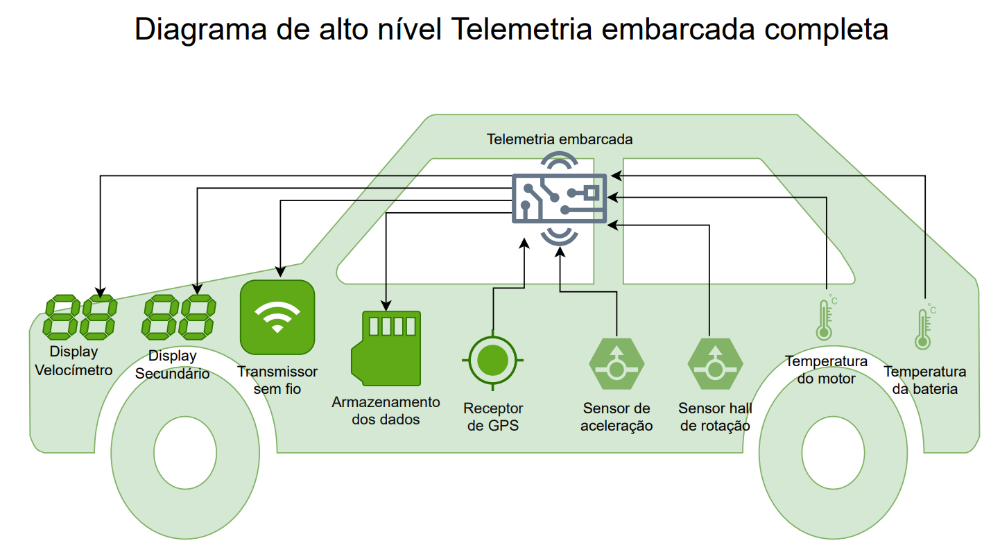

A seguir serão explicados os módulos que compõe a sistema de telemetria embarcada

#### Sensores Embarcados

Para a obtenção das condições físicas do veículo serão usados diferentes tipos de sensores. Cada um terá por função obter o dado a qual está destinado e enviar na forma de sinais elétricos ao microcontrolador que os interpretará e tratará a informação para posterior armazenamento e transmissão.

O seguinte diagrama de alto nível mostra os sensores que serão empregados bem como sua localização aproximada:

A escolha dos sensores seguiu critérios para atender as necessidades da obtenção de informações e facilidade de fixação mecânica bem como a precisão dos dados.
+ Sensores de temperatura: será usado termistores do tipo NTC que possuem resistência de 10k em temperatura de 25ºC. A obtenção da temperatura é feita através da topologia de divisor resistivo, onde juntamente com um resistor fixo de 10k emitirá um sinal de tensão que será interpretado pelo microcontrolador em uma porta com conversor analógico/digital. Dessa forma o sinal de tensão é convertido em uma temperatura correspondente via software no microcontrolador e então essa informação é usada para avaliar a temperatura atual dos componentes, neste caso bateria e motor elétrico do veículo;
+ Sensor Hall de rotação: Um sensor hall digital A3144 será usado para contabilizar o período de cada revolução da roda traseira do veículo. Este tipo de sensor utiliza campo magnético de um ímã permanente fixado no aro da roda. Assim, a cada revolução o sensor detecta o campo magnético e o converte em um sinal digital, desta forma, o microcontrolador utilizará um Timer com interrupção do tipo Input Capture para contar o tempo de cada rotação. Dessa maneira, com o tempo de cada rotação é possível obter a frequência com a qual a roda está girando, bem como rotação e velocidade;
+ Sensor de aceleração: Um potênciometro linear de 10k será usado como sensor do acelerador. A fim de armazenar e transmitir o uso do motor do veículo, será obtido o valor de tensão que vem do acelerador. Para isso um potenciômetro será usado na configuração de divisor resistivo e terá o papel de obter uma tensão que corresponde ao nível de aceleração do motor;
+ Módulo de GPS: O GPS será usado para poder analisar os dados com base na localização da pista ao qual o veículo está percorrendo. Essa informação é importante, pois, com a localização poderemos saber se o veículo estava realizando uma curva, percorrendo uma reta, uma determinada inclinação etc.
+  Sensor de Tensão: Um divisor resistivo será usado para obter uma tensão correspondente a tensão da bateria. Para adequar o nível de tensão para o microcontrolador poder interpretar, será devida a tensão da bateria (aproximadamente 36V) em cerca de 20 vezes. Dessa forma o conversor analógico digital do microcontrolador terá um valor de tensão máximo de 2.1V no caso de a bateria estar totalmente carregada. Ainda será inserido um diodo Zener de 3.6V para evitar ultrapassar o valor de tensão máximo que o microcontrolador aceita em sua entrada analógica. A tensão é importante para verificar o nível de bateria restante no protótipo veicular bem como calcular a potência instantânea juntamente com a corrente. Assim, a informação do nível de tensão é armazenada, transmitida e também informada ao piloto do veículo.
+ Sensor de Corrente: O sensor escolhido foi o módulo ACS712 de 30A máximo. Este sensor é bastante adequado para este projeto pois permite a conversão da variável corrente em uma tensão linear. A tensão fornecida para este sensor é de 2.5V em 0 A e a cada Ampere a tensão aumenta ou diminui em 66 mV a depender do sentido da corrente. O sensor de corrente será usado para analisar a corrente instantânea e calcular a potência instantânea do consumo pelo motor.

#### Módulo de transmissão sem fio Lo-ra

O Módulo de transmissão sem fio escolhido é o RA-02 com microcontrolador SX1278 que possui características de baixo consumo, longo alcance e capacidade necessária para transmissão dos dados obtidos pelos sensores embarcados. O protocolo  de comunicação entre o microcontrolador e o módulo transmissor é SPI que possibilita a ligação em conjunto com o módulo de cartão SD. A seguir será ilustrada a ligação do módulo ao microcontrolador:

#### Módulo Cartão microSD

Para o armazenamento dos dados para posterior análise, será utilizado um cartão de memória MicroSD que se comunica através do protocolo SPI com o microcontrolador. Dessa forma, será possível armazenar os dados em forma de arquivo de texto com separação com vírgula que possui facilidade em plotagem de gráficos e tratamento dos dados em softwares de planilhas.

#### Display duplo de 7 segmentos

A fim de tornar o dado de velocidade mais fácil de visualizar, o display de 7 segmentos foi escolhido por ter seus números grandes. Dessa forma o dado de velocidade será apresentado em tempo real que foi calculado anteriormente com base no sensor Hall ligado na roda. Este display será acionado utilizando multiplexação das portas digitais do microcontrolador, assim poupando pinos que poderão ser usados pelos sensores e módulos. Para isso, 2 transistores NPN BC547 serão usados para selecionar o dígito a ser impresso enquanto os pinos correspondentes aos segmentos são acionados. Esta multiplexação deverá ser feita em alta frequência (acima de 100Hz) para que torne-se confortável para visualização dos dígitos.

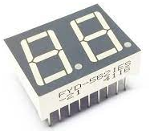

#### Display OLED

As informações secundárias tais como nível de bateria, tempo restante, nível de aceleração atual serão apresentados em um pequeno display  que se comunica com o microcontrolador através do protocolo I2C que possibilita a sua ligação com apenas 4 fios.

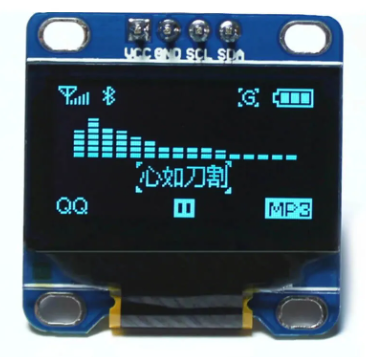

#### Regulação da tensão

A fim de alimentar adequadamente o microcontrolador e os módulos será usado um conversor Buck DC/DC LM2596 que possui capacidade de rebaixar a tensão da bateria que pode chegar a no máximo 42 V para 5V e ainda um regulador linear LM1117 para rebaixar para 3.3V. Assim, será possível alimentar os componentes com as tensões necessárias de 5V e 3.3V com corrente adequada e fusível na entrada para a proteção de todo o sistema em caso de falha.

#### Microcontrolador

O microcontrolador utilizado foi escolhido com base na capacidade, preço, acessibilidade de programas e ferramentas para desenvolvimento do software. A placa denominada Bluepill possui o microcontrolador STM32F103C8T6 com clock de 72MHz, relógio de tempo real integrado, entradas e saídas tolerantes a 5V, conversor analógico digital de 12 bits entre outras características que serão exploradas no projeto. Será utilizado sistema operacional embarcado FreeRTOS que este microcontrolador possui capacidade. Além disso, foram observadas as capacidades de protocolos de comunicação, memória e disponibilidade de projetos, exemplo nas referências.

Nota-se que para a sua programação se faz necessário um gravador denominado ST-Link.

##### Componentes principais da telemetria embarcada

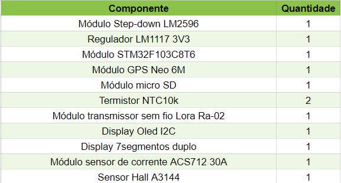

##### Esquema elétrico da telemetria embarcada

O seguinte esquema apresenta de forma organizada todos os componentes utilizados na telemetria embarcada divididos em: regulação de tensão, sensores, transmissor, módulo de armazenamento e displays.

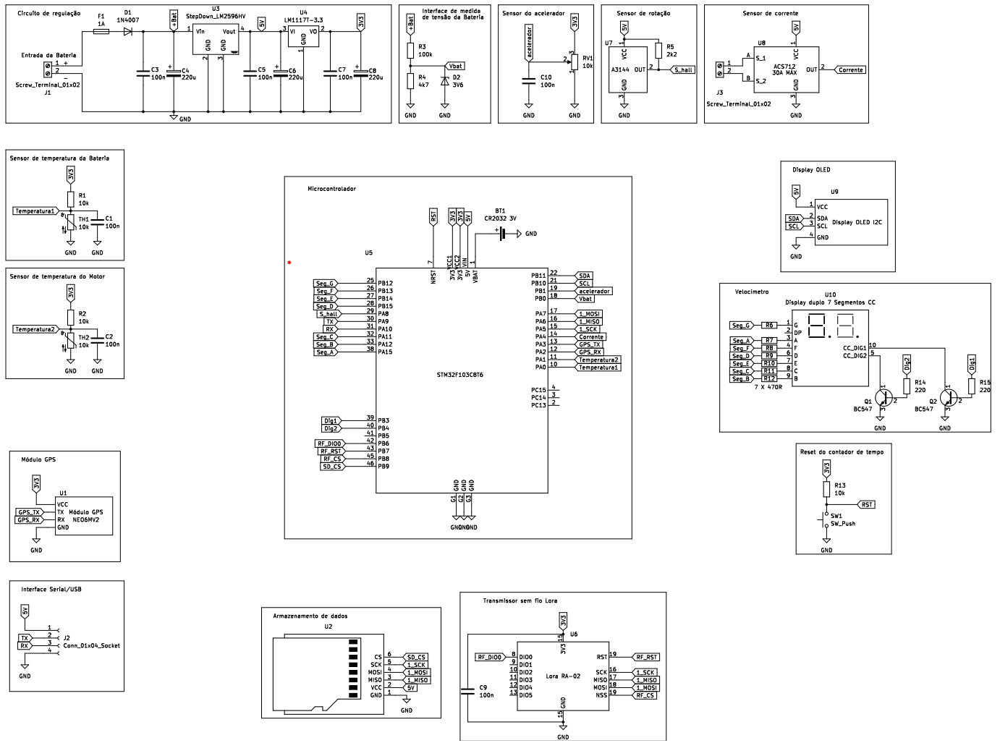

### Software da telemetria embarcada

Para gerir, configurar os periféricos, módulos e sensores será programado o software que será gravado no microcontrolador. A fim de facilitar e tornar o fluxo mais rápido e controlado bem como facilitar a programação, devido a grande quantidade de módulos que precisam ser controlados, será usado o sistema operacional embarcado FreeRTOS. A seguir indica-se o fluxo do software no microcontrolador com as tarefas que serão realizadas:

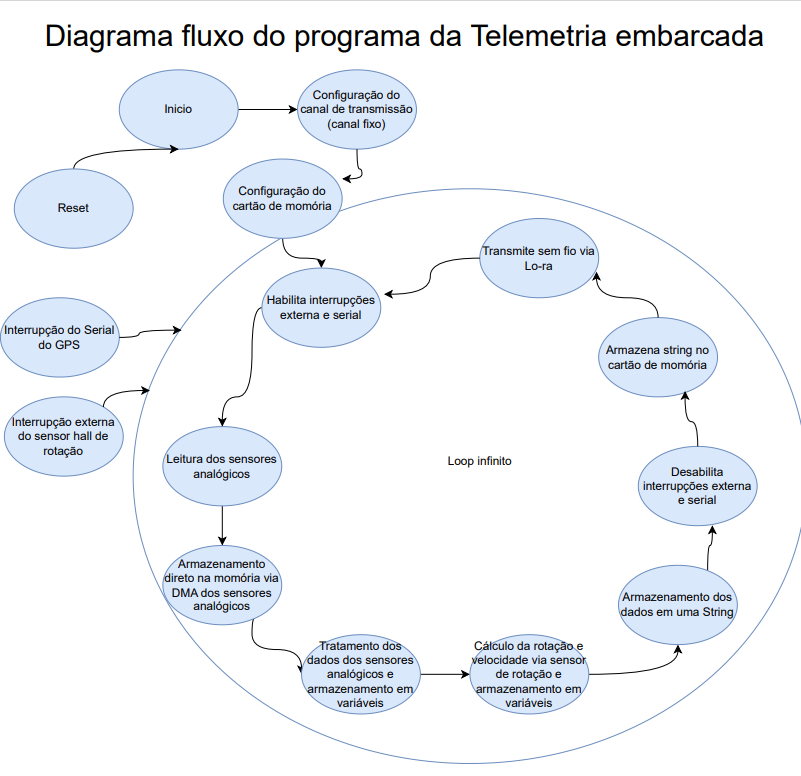

## Receptor da Telemetria

### Componentes principais do receptor da telemetria

O seguinte diagrama apresenta os componentes em alto nível que serão usados para a recepção dos dados:

Um computador será usado para ler os dados recebidos em tempo real, bem como plotagem de gráficos. Este computador será conectado ao receptor da telemetria via adaptador USB/Serial, visto que o receptor enviará dados em Serial que são recebidos pelo receptor sem fio no protocolo SPI. A alimentação do receptor como um todo é feita pela própria USB, não necessitando de fonte externa.

A seguir serão explicados os módulos que compõe o receptor da telemetria

#### Módulo de recepção sem fio Lo-ra

O Módulo de recepção é exatamente o mesmo utilizado para a transmissão, diferindo apenas em sua programação onde será usado apenas como receptor. Sua ligação é exatamente a mesma utilizada na telemetria embarcada: 

#### Microcontrolador

O microcontrolador será o mesmo da telemetria embarcada já explicado anteriormente.

##### Esquema elétrico do receptor da telemetria

O seguinte esquema apresenta de forma organizada todos os componentes utilizados no receptor da telemetria divididos em: receptor, microcontrolador e interface Serial.

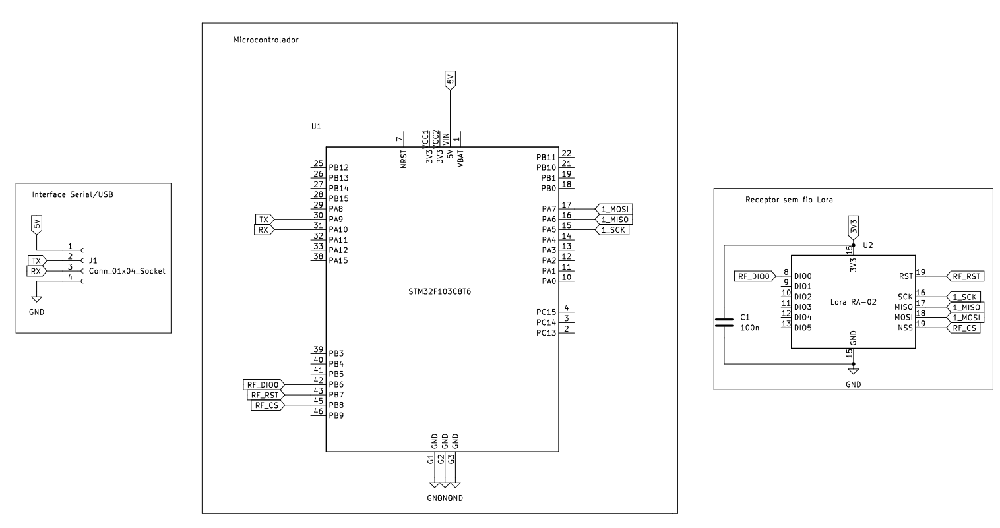

### Software do receptor da telemetria

Para gerir, configurar o receptor sem fio e a comunicação Serial, desenvolveu-se o seguinte raciocínio para o software do receptor. Será também utilizado FreeRTOS para facilitar o fluxo do programa visto que os dados são recebidos de acordo com o envio feito pelo receptor, assim necessitando ter grande prioridade na recepção e em prioridade secundária a comunicação Serial e apresentação dos dados no computador.

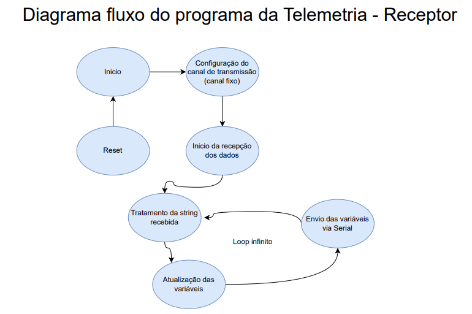

### Visualização dos dados recebidos

Para a visualização dos dados recebidos será utilizada a plataforma Arduino e o terminal Serial que possui capacidade de apresentar dados numéricos e gráficos dos dados recebidos pela porta serial que virá do conversor USB/Serial utilizado. O Diagrama a seguir mostra o procedimento de configuração do terminal Serial. É importante salientar que os dados devem estar formatados para que o gráfico seja utilizado na apresentação dos dados dos sensores.

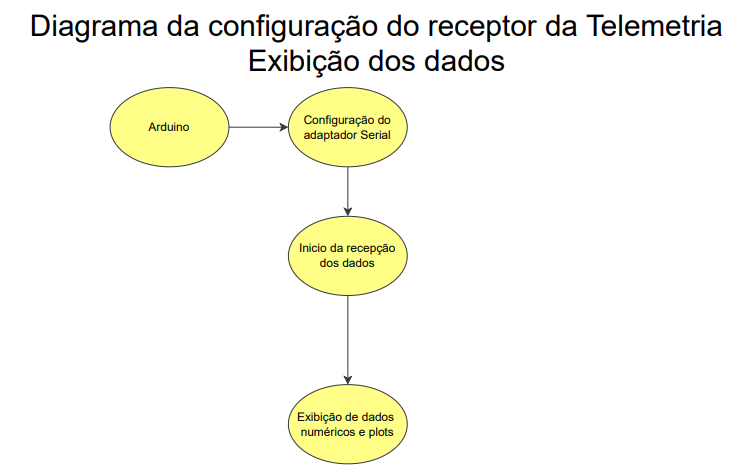

Esta etapa do projeto será melhor desenvolvida futuramente, visto que deve ser dedicado muito tempo de projeto em software de apresentação de dados. Nesta etapa do projeto será focada mais em hardware e na funcionalidade da telemetria.

## Atuadores remotamente controlados

O protótipo veicular conta com um powertrain formado pelos seguintes componentes:

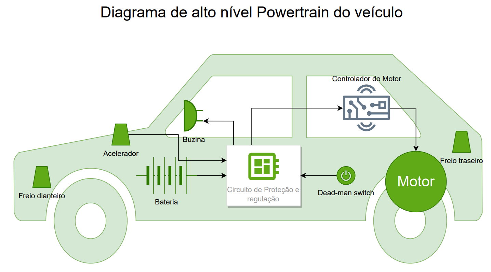

+ Bateria: Esta bateria será usada para a propulsão do veículo, alimentação de todos os atuadores e inclusive da telemetria embarcada. Sua capacidade é de 2.2 Ah nominal, podendo fornecer taxa de descarga superior a 2X a corrente nominal. Sua tensão será de 24V para atender a necessidade do motor elétrico de propulsão;
+ Motor: O motor utilizado será do tipo brushless com potência de 24W nominais, seu funcionamento é exatamente igual ao motor utilizado no protótipo veicular real (motor brushless de ímã permanente com sensores hall);
+ Controlador do motor: Para acionar o motor brushless é necessário o controlador que interpreta o valor da aceleração demandada, converte a corrente contínua da bateria em pulsos para as 3 fases do motor brushless;
+ Circuito de proteção e regulação: Este circuito conta com relés e reguladores de tensão, onde colocará a bateria ao controlador se os botões de emergência e dead-man switch estiverem corretos;
+ Dead-man switch: este componente é um botão que no protótipo real o piloto deve acionar para possibilitar a propulsão do veículo, caso contrário o motor ficará sem alimentação e portanto o veículo permanece em inércia até parar;
+ Buzina: Um botão aciona uma buzina alimentada com 12V proveniente do circuito de regulação;
+ Freios: na dianteira e na traseira possui freios independentes que devem ser capazes de parar completamente o veículo quando necessário;
+ Acelerador: Um pedal ou um acelerador de mão é utilizado para informar a aceleração solicitada ao controlador para então colocar o veículo em movimento.

### Atuadores embarcados

Para possibilitar a atuação nos controles internos do protótipo veicular, fez-se necessário desenvolver um conjunto de atuadores que simularam o piloto embarcado. Dessa forma, acelerador, freios, direção dead-man switch e buzina terão um atuador eletro-mecânico que simulará o controle humano. A seguir o diagrama ilustra o funcionamento desses atuadores nos sistemas do veículo:

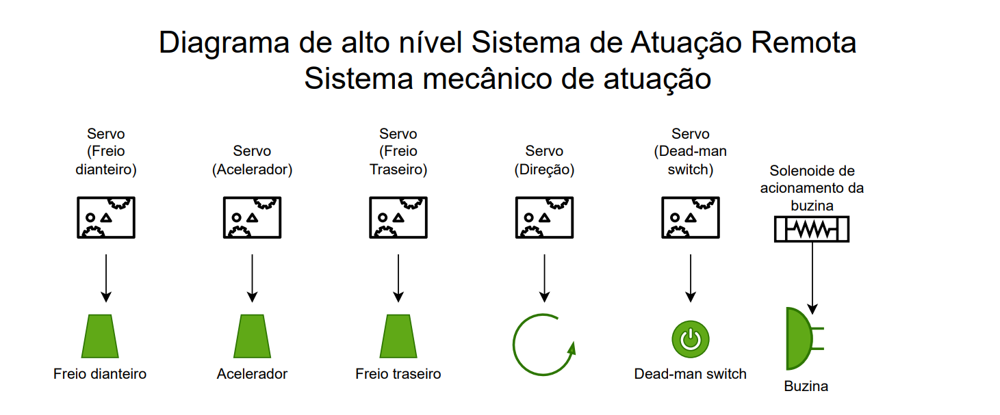

O funcionamento se baseará em um receptor que controlará os servo motores e solenóide que atuarão de acordo com o que for solicitado pelo controle remoto:

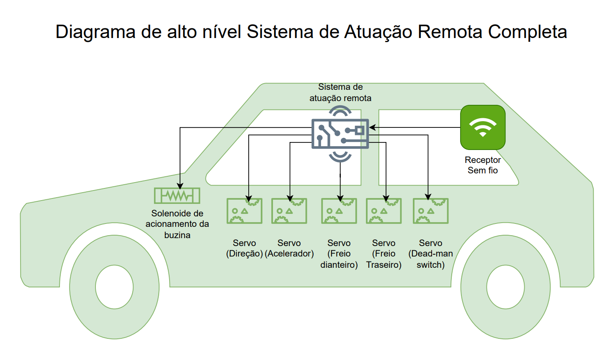

##### Componentes principais do sistema de atuação remota

##### Esquema elétrico do sistema de atuação remota

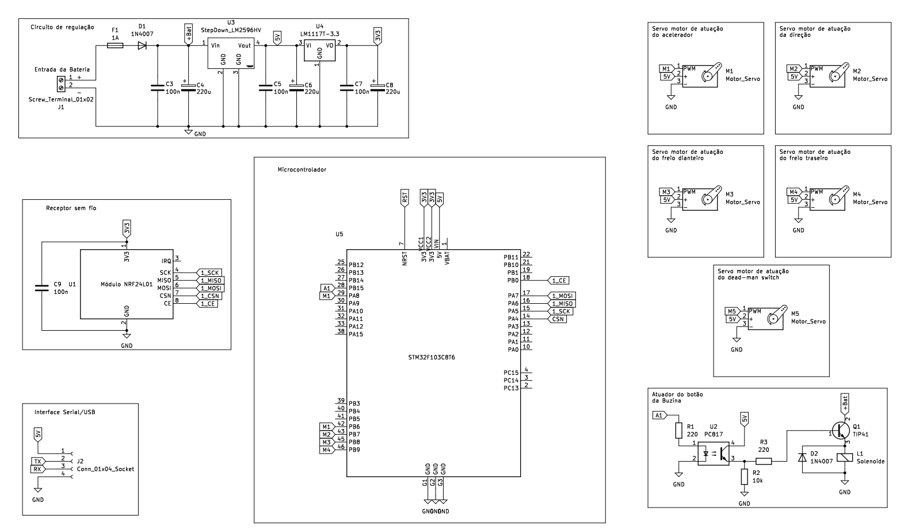

### Software do sistema de atuação remota

Para gerir o receptor e os servo motores e solenóide, será usado um microcontrolador programado para tratar os dados recebidos e acionar a posição dos atuadores. A seguir o seguinte diagrama ilustra o funcionamento do fluxo do software da atuação remota:

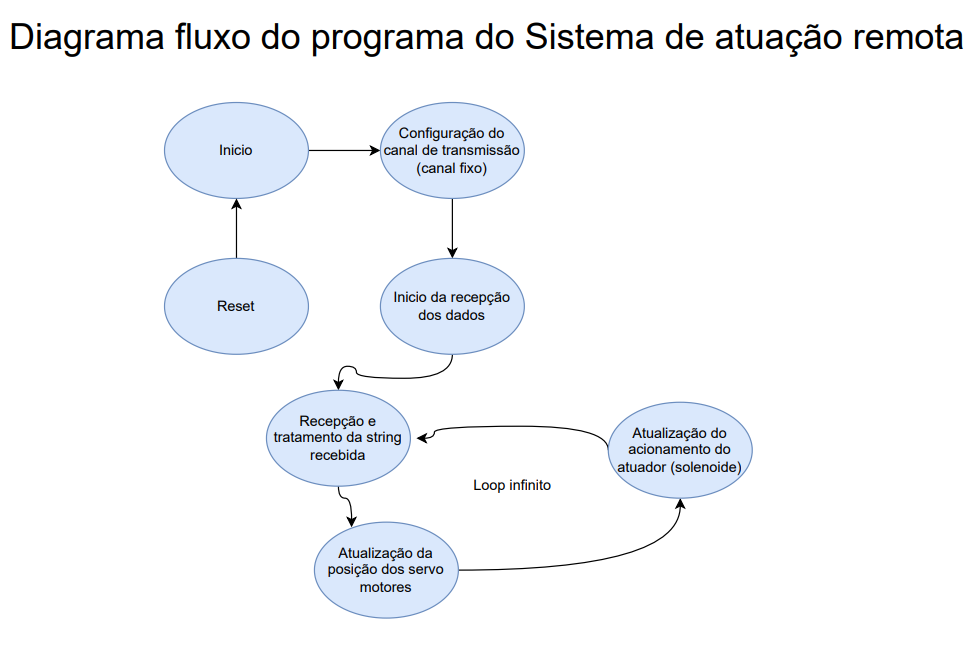

## Controle remoto

Como já comentado o veículo terá atuadores que vão simular um piloto embarcado, atuando nos controles do veículo. Assim, para que essa simulação seja feita, optou-se pelo uso de controle remoto que terá joysticks para acelerador, freio, direção, dead-man switch e buzina. 

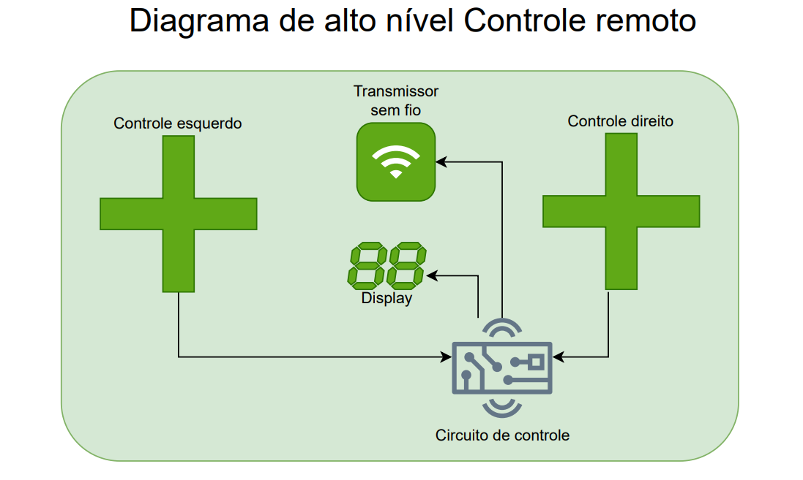

##### Componentes principais do controle remoto

##### Esquema elétrico do controle remoto

O seguinte esquema apresenta de forma organizada todos os componentes utilizados na telemetria embarcada divididos em: regulação de tensão, potenciômetros, transmissor e display.

### Software do controle remoto

Para interpretar a posição dos joysticks do controle remoto e traduzir a informação em dados que serão transmitidos sem fio, será usado um microcontrolador que será programado para ler os valores de tensão dos potenciômetros, interpretar e enviar ao transmissor sem fio.

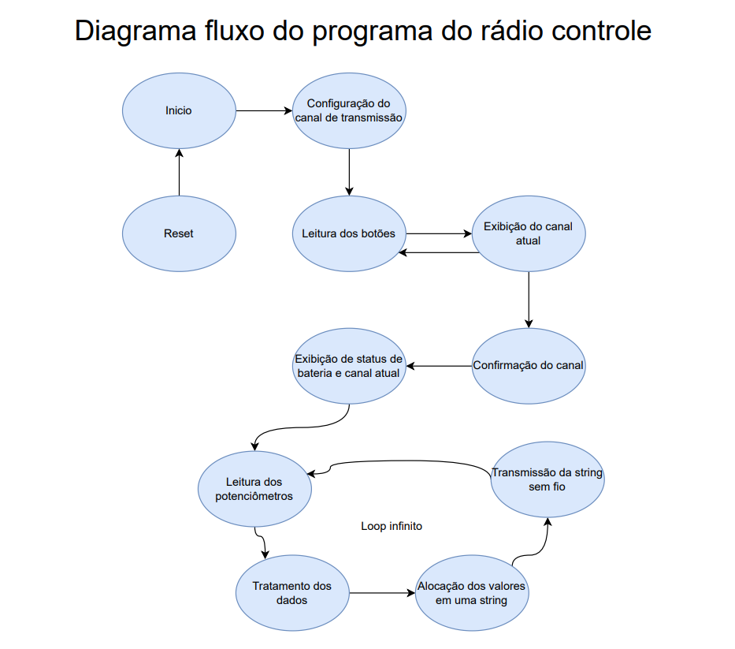

## Softwares e ferramentas utilizadas

#### Gravador para microcontrolador STM32

Para a gravação do microcontrolador é necessário o gravador denominado ST-link conforme a imagem a seguir:

Este gravador possui interface USB e utiliza 4 jumpers para DATA e CLOCK com o microcontrolador.

#### FreeRTOS

Para facilitar a integração dos muitos sensores e módulos utilizados na telemetria embarcada, no sistema de atuação remota e no controle remoto o sistema operacional FreeRTOS será usado visto que ele possui grandes vantagens tais como: confiabilidade, escalabilidade, previsibilidade, rápida performance.

#### STM32 CubeMX
O STM32 Cube MX é uma ferramenta geradora de código fonte em linguagem “C”, mediante as configurações e opções escolhidas pelo usuário através de interfaces gráficas, assim facilitando a configuração de periféricos utilizados do microcontrolador STM32.

#### Keil IDE

O Keil IDE será usado para a programação dos microcontroladores STM32 e para geração dos arquivos Hexadecimais que serão gravados.

#### Kicad

O software Kicad foi escolhido para a realização dos esquemas por ser uma ferramenta open-source e possibilitar a esquematização e design do layout das placas de circuito impresso.

#### Placa Universal perfurada

As placas mais simples (receptor de telemetria e controle remoto) serão desenvolvidas em placas universais perfuradas por permitirem a montagem mais rápida dos circuitos. 

#### Arduino IDE

Por possibilitar a plotagem de gráficos em tempo real com dados provenientes da interface Serial, será empregado para a ilustração de dados principais do receptor de telemetria.

